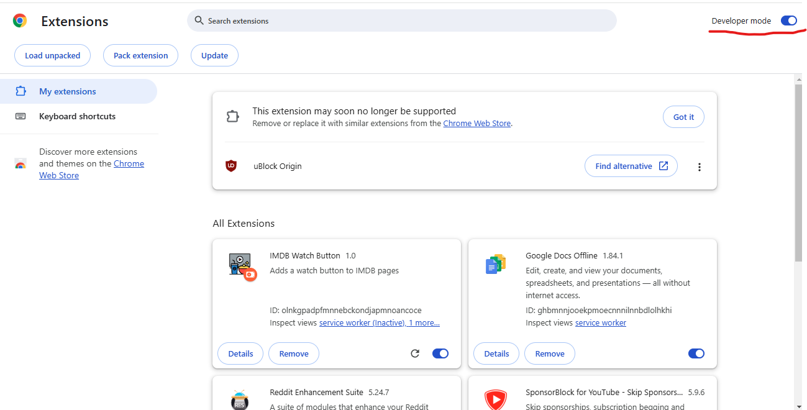

# IMDB Watch Button Extension

A Chrome extension that enhances IMDB with a "Watch Now" button for instant streaming of movies and TV shows.

## Features

- 🎬 Adds "Watch Now" button to IMDB movie and TV show pages
- 📺 Built-in TV show episode viewer with season navigation
- 🎯 Tracks watch history for quick access
- ⭐ Favorite shows management
- 🌓 Dark/Light theme support
- 🔐 Secure TMDB API integration

## Installation

1. Clone this repository or download the ZIP file
2. Open Chrome and navigate to `chrome://extensions/`
3. Enable "Developer mode" in the top right
4. Drag and drop the zip file or click "Load unpacked" and select the extension directory if unzipped/cloned




## Configuration

Before using the extension, you'll need to configure your TMDB API token:

1. Visit [TMDB API Settings](https://www.themoviedb.org/settings/api) to get your API token
   - Sign up for an account if you don't have one
   - Request an API key (choose "Developer" option)
2. Click the extension's gear icon (⚙️) in the popup
3. Paste your TMDB API token in the configuration page
4. Click "Save" to store your token

## Usage

### Movies
1. Navigate to any IMDB movie page
2. Click the "Watch Now" button next to the title
3. The movie will open in a new tab ready to stream

### TV Shows
1. Navigate to any IMDB TV show page
2. Click the "Watch Now" button next to the title
3. In the viewer page:
   - Select seasons from the dropdown
   - Click episodes to watch
   - Track your progress automatically

### Features
- **Recent History**: Access recently watched content from the popup
- **Favorites**: Star shows/movies to save them for later
- **Theme Toggle**: Switch between dark and light themes
- **Episode Tracking**: Automatically saves your last watched episode

## Privacy & Security

- All API calls are made securely over HTTPS
- Your TMDB token is stored locally in your browser
- No personal data is collected or transmitted
- Watch history is stored locally on your device

## Technical Details

The extension uses:
- Chrome Extension Manifest V3
- TMDB API for metadata
- Local storage for settings and history
- Content Security Policy (CSP) for security

## Files Structure

```
├── manifest.json
├── background.js
├── content.js
├── popup.html
├── popup.js
├── viewer.html
├── viewer.js
├── config.html
├── config.js
├── icon16.png
├── icon32.png
├── icon48.png
└── icon128.png
```

## Contributing

1. Fork the repository
2. Create your feature branch (`git checkout -b feature/AmazingFeature`)
3. Commit your changes (`git commit -m 'Add some AmazingFeature'`)
4. Push to the branch (`git push origin feature/AmazingFeature`)
5. Open a Pull Request

## License

This project is licensed under the MIT License - see the LICENSE file for details.

## Acknowledgments

- TMDB for providing the API
- IMDB for the movie/TV show information
- The open-source community for inspiration and resources
